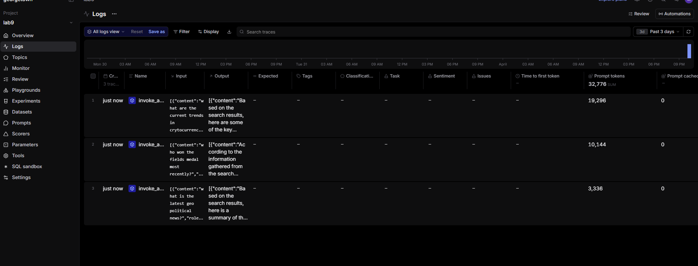
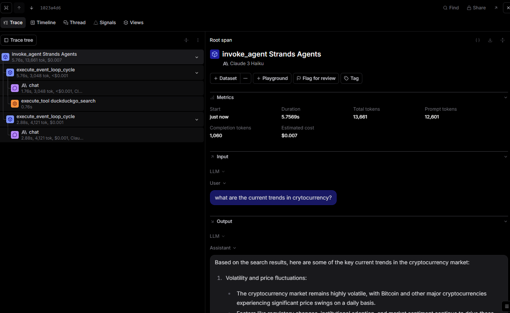
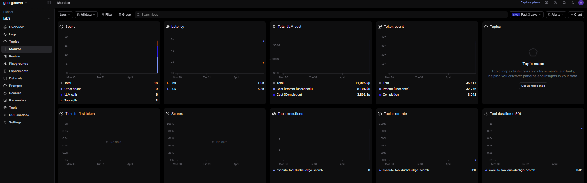

# Agent Observability Analysis

## Traces and Span Hierarchy

Inspection of the trace corresponding to the cryptocurrency query reveals a well-defined hierarchical structure of spans. At the root is the invoke_agent span, which has a total duration of 5.76 seconds and an associated cost of $0.007. Nested within this root span is an execute_event_loop_cycle span, which encapsulates two primary types of child spans, chat spans representing llm calls to claude, and a tool span corresponding to duckduckgo search.

A consistent execution pattern emerges across all three queries. Each query involves exactly two llm calls. The first llm call determines whether to invoke an external tool in this case, the duckduckgo search api followed by execution of the tool itself (approximately 0.76 seconds in the cryptocurrency trace). A second llm call then synthesizes the retrieved information into a final response. This results in a recurring two phase interaction pattern that can be characterized as reason then act then respond. The first phase includes both an llm call and a tool invocation, while the second phase consists solely of response generation.

## Metrics and Token Usage

Despite the uniformity in execution structure, the three queries exhibit substantial variation in token usage. A summary of key metrics is presented below:

| Query             | Order | Prompt Tokens | Completion Tokens | Total Tokens | Duration | Cost       | LLM Calls | Tool Calls | Tool Errors |
| ----------------- | ----- | ------------- | ----------------- | ------------ | -------- | ---------- | --------- | ---------- | ----------- |
| Geopolitical news | 1st   | 3,336         | 670               | 4,006        | 5.18s    | $0.0017    | 2         | 1          | 0           |
| Fields Medal      | 2nd   | 10,144        | 837               | 10,981       | 3.90s    | $0.0036    | 2         | 1          | 0           |
| Cryptocurrency    | 3rd   | 19,296        | 1,534             | 20,830       | 5.76s    | $0.0067    | 2         | 1          | 0           |

The observed increase in prompt tokens across successive queries is primarily attributable to the accumulation of conversational context. Each subsequent query incorporates the full history of prior interactions, leading to a near 6x increase in prompt tokens from the first to the third query. In contrast, completion token usage remains relatively stable, reflecting the consistent size of generated responses.

Aggregate metrics from the monitoring dashboard further contextualize these observations. Across all traces, there are 18 spans in total, comprising 6 llm calls, 3 tool invocations, and 9 auxiliary spans. Latency metrics indicate a median response time of 1.9 seconds and a 95th percentile latency of 5.8 seconds.

## Patterns and Observations

A key insight from this analysis is the significant impact of conversational history on computational cost. The ratio of prompt to completion tokens increases from approximately 5:1 in the initial query to 13:1 in the final query, driven entirely by the accumulation of prior context. In production environments supporting extended interactions, this trend would likely constitute a major cost driver, as the marginal utility of historical context diminishes relative to its contribution to token usage.

Latency patterns, by contrast, exhibit moderate variability. The geopolitical query required 5.18 seconds, the Fields Medal query completed in 3.90 seconds, and the cryptocurrency query took 5.76 seconds. Notably, the second query achieved the lowest latency despite increased prompt size, likely due to the brevity and factual nature of the required response. From a reliability standpoint, system performance is consistent and robust. Each query involves exactly one tool invocation, with no recorded tool or LLM errors. The absence of retries or redundant tool calls suggests efficient orchestration and effective decision-making by the agent.

Finally, an analysis of latency distribution indicates that tool execution contributes a relatively small portion of overall response time. The DuckDuckGo search tool exhibits a median execution time of approximately 0.9 seconds, whereas LLM calls dominate total latency, ranging from 2.7 to 4.6 seconds. This identifies LLM inference as the primary bottleneck in system performance.

