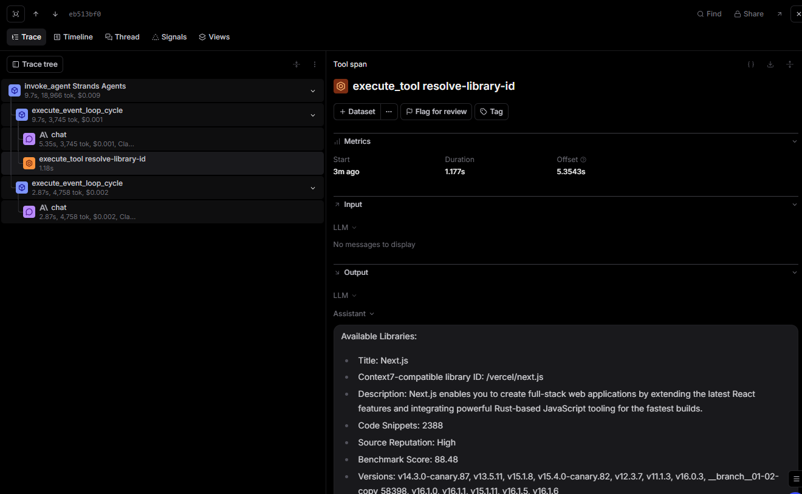

# MCP Observability Analysis

I connected to the context7 mcp server using the strands sdk mcp client with streamable http transport. The server provided two tools, resolve-library-id (for looking up library identifiers in the index) and query-docs (for searching programming documentation and retrieving code examples). These were combined with the existing duckduckgo search tool, giving the agent three tools total.

Analysis of the Braintrust traces shows that all three tools were consistently registered in each trace’s metadata under duckduckgo_search, resolve-library-id, query-docs.However, the agent selected duckduckgo for most queries, including documentation focused ones. This behavior likely reflects a preference by claude for a general purpose, well described tool over the mcp tools, whose metadata was minimal. In a production setting, improving tool descriptions or explicitly guiding tool selection in the system prompt would likely lead to better utilization of mcp tools, particularly for documentation-related queries.

